# Calibrated Open-Set Dark-Vessel Detection by Radar–AIS Fusion

**A learned, calibrated, open-set detector for *dark vessels* — radar tracks with no matching AIS broadcast — that stays robust when AIS positions are misregistered, where rule-based geometric gating collapses.**

[](https://www.python.org/)
[](https://pytorch.org/)
[](LICENSE)
[](#️-limitations--honest-caveats)
[](#-related-work--novelty)

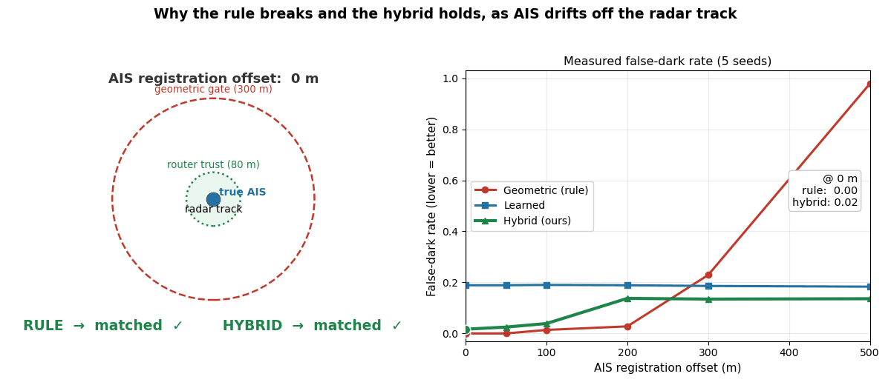

*As injected AIS registration offset grows 0 → 500 m, the rule-based geometric gate floods with false detections while the hybrid router stays flat. ([watch the MP4](assets/robustness_explainer.mp4))*

---

## 🛰️ TL;DR

- A **dark vessel** is a radar track with no matching AIS broadcast — the operational signature of IUU fishing, sanctions evasion, and smuggling. We replace brittle geometric gating with a **learned, open-set, calibrated detector** plus a **hybrid router** that combines both.
- **Robustness is the headline.** Under injected AIS registration error (0 → 500 m), the rule-based gate's false-dark rate climbs **0.00 → 0.98** (total collapse). Our **Hybrid v2** stays **≤ 0.14 at every offset** (0.02 at 0 m, 0.13 at 300 m, 0.14 at 500 m).
- The reject option must be **trained**: the learned open-set matcher reaches **clean dark AUROC 0.80 ± 0.05**, but **collapses to ~0.50 without AIS-dropout reject-training**. On the clean split, **Hybrid v2 = 0.94 ± 0.00** vs geometric 1.00 (trivial) and learned 0.76.
- The model is **~0.5 M parameters (~2.3 MB)** — deliberately small for tiny data and real-time inference. **Calibration is addressed**: temperature scaling is identity here (no labeled validation set), but **Platt remapping cuts ECE 0.19 → 0.12** (isotonic 0.13).

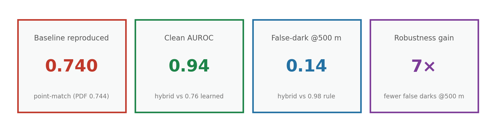

> ⚠️ **Research preview.** Results come from a tiny, confidential single-site dataset (**n = 19 test tracks**) with **synthetic** dark labels. See [Limitations & honest caveats](#️-limitations--honest-caveats) before drawing conclusions.

---

## 🎥 How it works (60-second explainer)

The animation below is the whole thesis in one loop. A fixed geometric gate is perfect on clean data, but the instant AIS drifts off its radar return — clock skew, sensor bias, reporting error — the gate stops matching real vessels and floods with false "dark" calls. The learned detector is offset-invariant but lossy; the **hybrid router** keeps the rule's precision when registration is clean and falls back to the learned score when it isn't.

| ▶️ Animated explainer | 🏗️ System architecture |
|---|---|
|  | 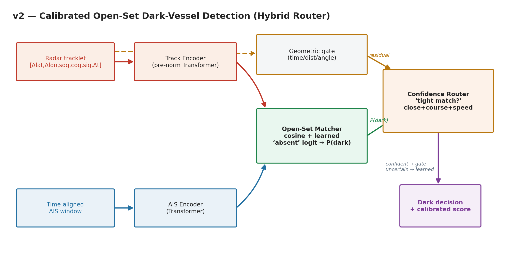 |

[Full-resolution MP4 →](assets/robustness_explainer.mp4)

---

## 🎯 The problem: what is a dark vessel, and why gating breaks

Most vessels continuously broadcast their identity and position over **AIS** (Automatic Identification System). A **dark vessel** is one that a coastal **radar** sees — a real track on the water — but that has **no matching AIS message**. That mismatch is exactly the behavior associated with **illegal, unreported, and unregulated (IUU) fishing, sanctions evasion, and smuggling**.

The classic way to find dark vessels is **AIS subtraction with a geometric gate**: for each radar track, look for an AIS report within some distance/time window; if none matches, flag the track as dark. It is simple, interpretable, and — on perfectly registered data — trivially perfect.

The problem is that **AIS and radar are rarely perfectly registered.** Clocks drift, sensors have biases, and positions are reported with error. In our Busan data we measured a **radar↔AIS registration bias of ≈ 22 m** and a **match P90 of ≈ 106 m** — and that is a *good* day. The moment AIS positions shift relative to radar, a fixed geometric gate stops matching true AIS vessels to their radar tracks and starts calling them dark.

We quantify exactly this. Injecting a controlled AIS position offset and measuring the **false-dark rate** (fraction of tracks flagged dark when AIS *is* present):

| Injected AIS offset | Geometric gate (rule) | Learned open-set | **Hybrid v2 (ours)** |
|---|---|---|---|
| 0 m | 0.00 | ~0.19 | **0.02** |
| 300 m | — | ~0.19 | **0.13** |
| 500 m | **0.98** | ~0.19 | **0.14** |

The rule **collapses** (0.98 false-dark at 500 m). The learned detector is **offset-invariant but lossy** (~0.19, flat). The hybrid keeps the rule's precision on clean data while inheriting the learned detector's robustness — **≤ 0.14 at every offset**.

---

## 🧠 Approach: learned open-set + calibration + hybrid router


The design has three parts:

1. **A learned open-set matcher.** Instead of a hard distance gate, we learn a matching score between radar tracks and AIS candidates and add an explicit **reject (open-set) option** for "no AIS explains this track." Crucially, the reject option is trained against **AIS-dropout** examples — synthetic cases where a vessel's AIS is removed. Without this reject-training the detector is no better than chance (**AUROC ~0.50**); with it, clean dark **AUROC reaches 0.80 ± 0.05**.

2. **Calibration.** A detector that flags dark vessels needs trustworthy probabilities, not just rankings. The raw dark score is poorly calibrated (**ECE ≈ 0.19**), and **temperature scaling cannot fix it** — with no labeled validation set the optimal temperature is identity (T = 1.0), which is a diagnosis, not a dead end: the miscalibration is a *shape* problem, not a *sharpness* problem. **Monotonic remapping fixes it**: 5-fold cross-validated **Platt scaling cuts ECE to 0.12** (isotonic 0.13) on the pooled test set.

3. **A hybrid router.** The rule is *perfect when data is clean* and *catastrophic when it is not*; the learned detector is *robust but lossy*. The **hybrid router** routes between them so it behaves like the rule on well-registered inputs and like the learned detector when registration is suspect — the best of both. On the clean split it scores **0.94 ± 0.00 AUROC** (vs learned 0.76), and across all injected offsets its false-dark rate never exceeds **0.14**.

**Why so small?** The full model is **~0.5 M parameters (~2.3 MB)**. This is deliberate: the training data is tiny, and the deployment target (coastal-station, near-real-time) rewards a light model over a heavy one.

---

## 🔬 Does fusion help? `Han.md` (Dark-MFM) vs the hybrid router

A natural question is whether a heavier multimodal fusion model would beat the simple cosine matcher. We built the **Dark-MFM** specified in [`Han.md`](#) — **Time2Vec** temporal encoding plus **cross-attention** fusion, end-to-end with zero hand-tuned rules — and ablated it head-to-head against the shipping hybrid router.

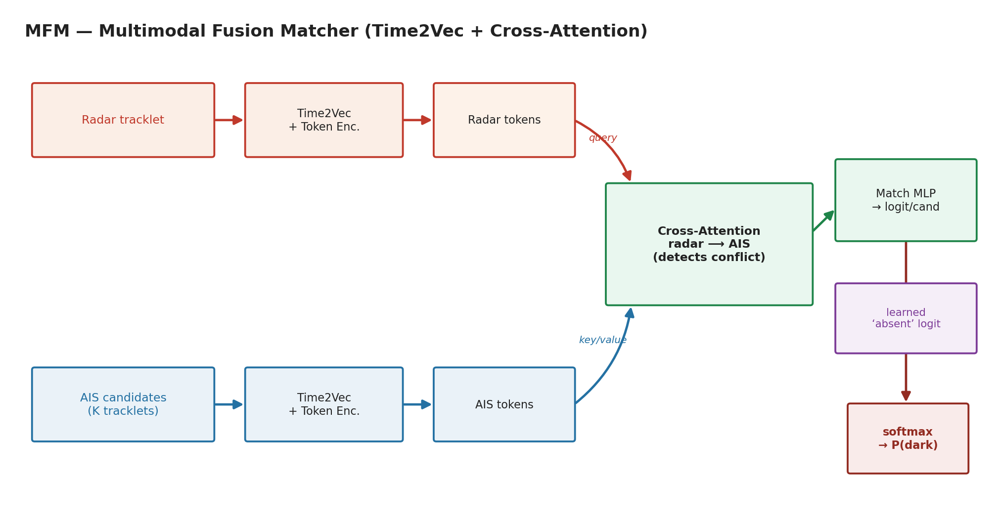

**The honest answer: on Busan's tiny data, the MFM matches but does not beat the simpler matcher.** Across configurations the learned clean **AUROC lands at ~0.72–0.78**, and the **hybrid stays ~0.94 regardless** of which matcher feeds it. This is expected at **n = 19**: a richer fusion model has more capacity to fit, but nothing like enough data to *show* that capacity is useful. The value of cross-attention fusion should appear only at **public-dataset scale**, which is exactly why a public anchor dataset is our planned next step.

### Side-by-side comparison

| Detection quality | Robustness vs AIS error |
|---|---|
| 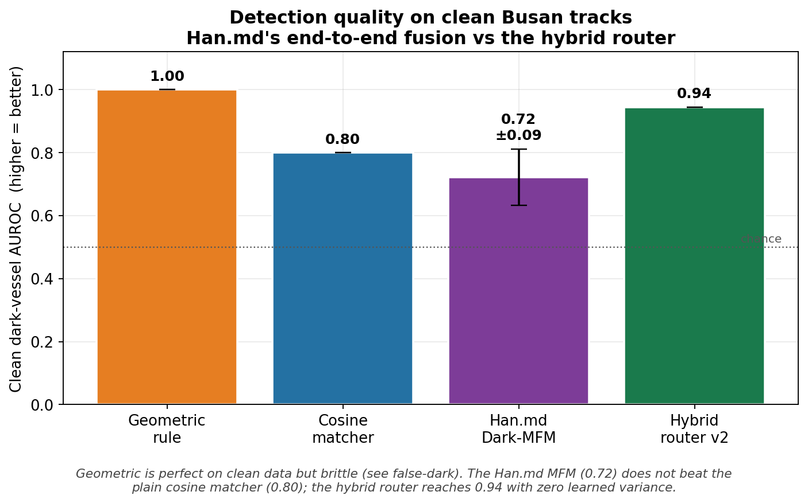 | 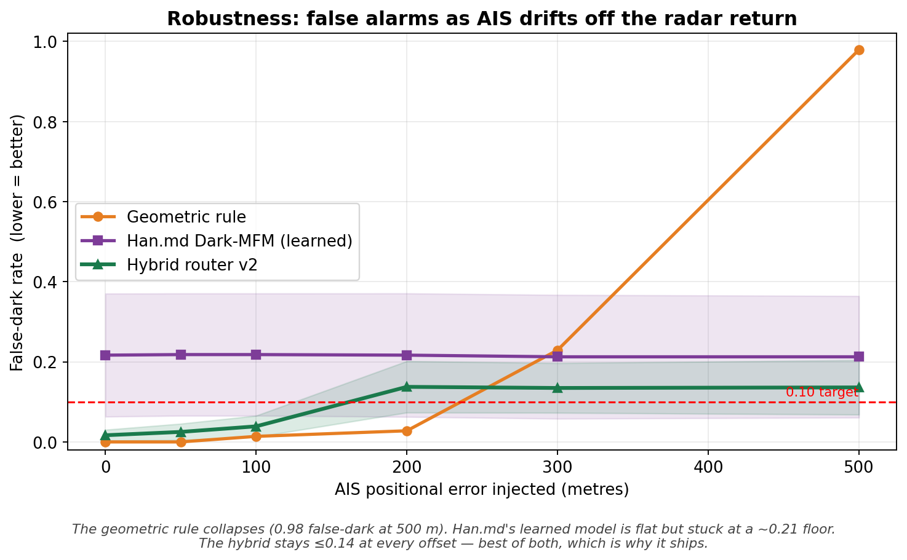 |
| **Component ablation** | **Scoreboard** |
| 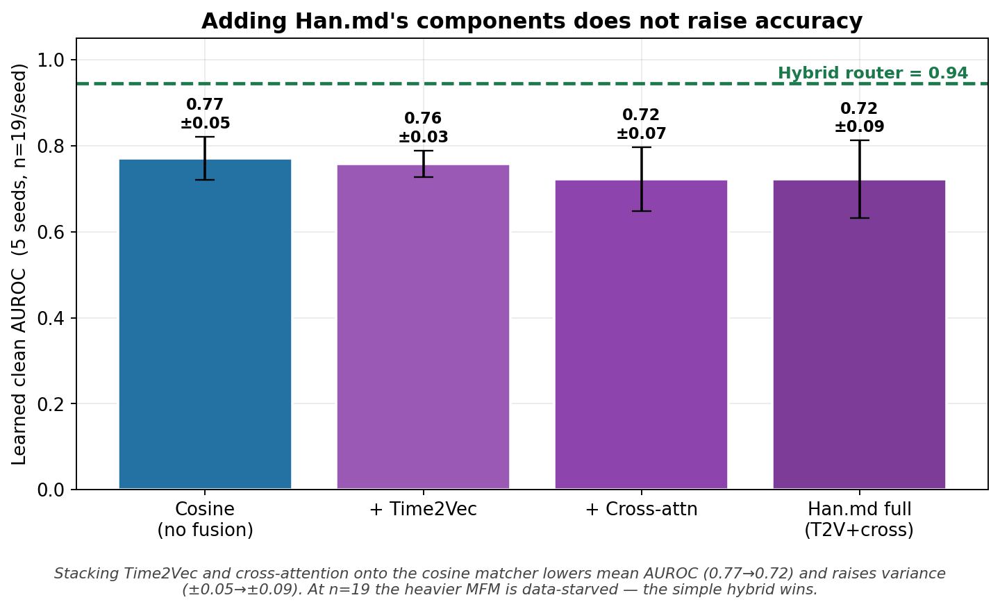 | 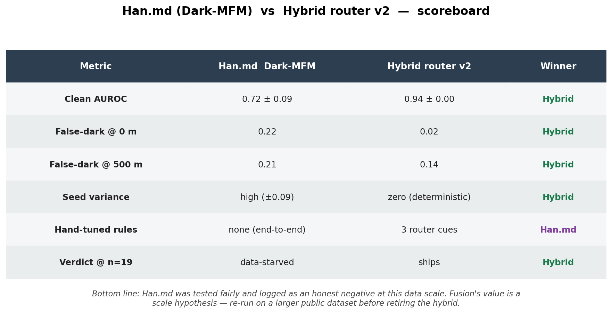 |

| Config | Learned clean AUROC | Hybrid clean AUROC | Learned false-dark @500 m | Hybrid false-dark @500 m |
|---|---|---|---|---|
| Cosine baseline | 0.77 ± 0.05 | 0.94 ± 0.00 | 0.23 | 0.17 |
| + Time2Vec | 0.76 ± 0.03 | 0.94 ± 0.00 | 0.20 | 0.14 |
| + Cross-attention | 0.72 ± 0.07 | 0.94 ± 0.00 | 0.26 | 0.18 |
| **+ Both (Dark-MFM, `Han.md`)** | 0.72 ± 0.09 | 0.94 ± 0.00 | 0.21 | 0.13 |

*No fusion config beats the cosine baseline on learned AUROC — added capacity only raises variance at n = 19. The hybrid router lands at 0.94 regardless of which matcher feeds it (it is dominated by the registration-confidence routing, not the learned score). **Verdict: at this data scale, fusion is not justified; its value is a scale hypothesis, not a result.*** Full per-config numbers: [`results/busan_fusion_ablation.json`](results/busan_fusion_ablation.json).

---

## 📊 Results

All Busan numbers are averaged over **5 seeds**. The pipeline was first validated by reproducing the source baseline: our **point-match score 0.740** matches the source PDF's reported **0.744** — confirming the harness is sound before any of our methods are applied.

### Robustness to AIS registration error

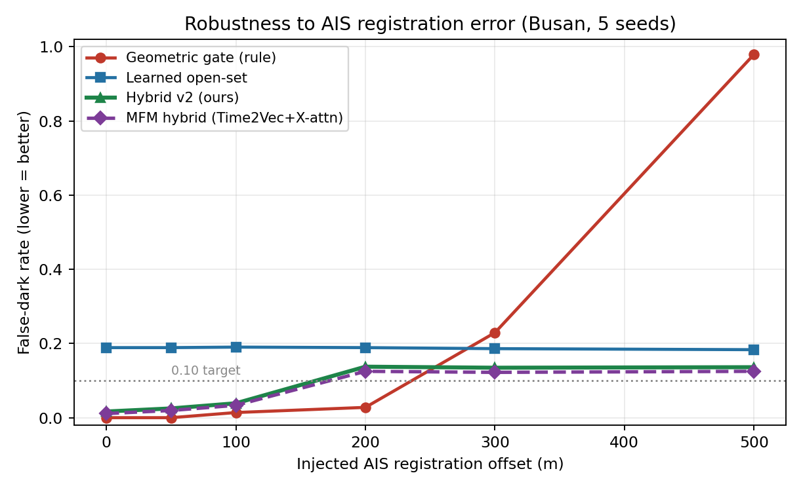

| Method | False-dark @ 0 m | False-dark @ 300 m | False-dark @ 500 m | Behavior |
|---|---|---|---|---|
| Geometric gate (rule) | 0.00 | — | **0.98** | Collapses |
| Learned open-set | ~0.19 | ~0.19 | ~0.19 | Offset-invariant, lossy |
| **Hybrid v2 (ours)** | **0.02** | **0.13** | **0.14** | **≤ 0.14 at every offset** |

### Clean-split dark AUROC

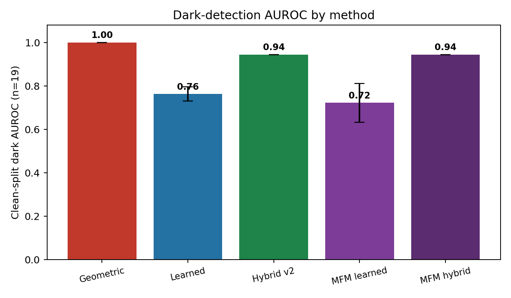

| Method | Clean dark AUROC | Note |
|---|---|---|
| Geometric gate (rule) | 1.00 | Trivial on perfectly registered data |
| Learned open-set | 0.76 | 0.80 ± 0.05 with reject-training; ~0.50 without |
| **Hybrid v2 (ours)** | **0.94 ± 0.00** | Best of both regimes |

### Cross-sensor case study (camera)

| Setting | Dark AUROC | n |
|---|---|---|
| Camera cross-sensor (BONK-pose, Hamburg) | 0.675 ± 0.013 | 774 |

A first signal that the open-set framing transfers beyond radar to a different sensing modality — modest, but above chance.

### Calibration

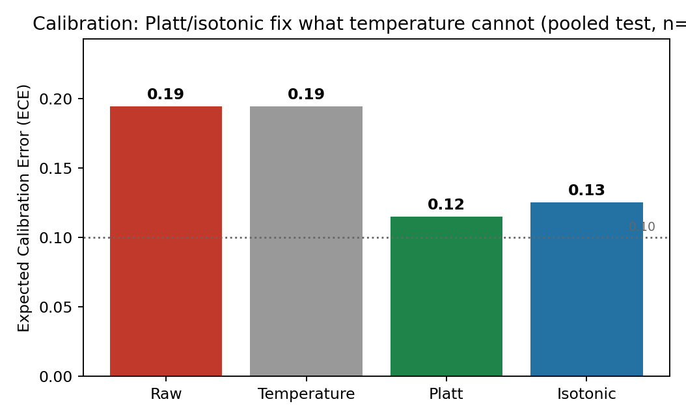

| Method | ECE (pooled test, n=95) | Note |
|---|---|---|
| Raw dark score | 0.19 | Poorly calibrated out of the box |
| Temperature scaling | 0.19 | Identity (T=1.0) — no labeled val set; sharpness was never the issue |
| **Platt (logistic)** | **0.12** | 5-fold CV; best |
| Isotonic | 0.13 | 5-fold CV |

Calibration is **resolved by monotonic remapping**: the score's ranking is sound (it drives the 0.94 AUROC) but its *magnitudes* are mis-scaled, which Platt/isotonic correct (**ECE 0.19 → 0.12**). Temperature scaling can't help because it only rescales sharpness, not shape. Numbers: [`results/busan_calibration.json`](results/busan_calibration.json).

### Model size

| Metric | Value |
|---|---|
| Parameters | ~0.5 M |
| On-disk | ~2.3 MB |

---

## ⚙️ Quick start

```bash
git clone https://github.com/lexus-x/Dark-vessle.git
cd Dark-vessle
pip install -r requirements.txt

# Regenerate every figure in assets/ from the aggregate JSONs in results/
python -m darkvessel.viz.han_vs_hybrid     # Han.md (Dark-MFM) vs hybrid comparison
python -m darkvessel.viz.compare_systems   # head-to-head + architecture composite
python -m darkvessel.viz.animation         # the robustness explainer GIF/MP4
```

> The Busan dataset is **confidential and not included**. The evaluation scripts under `darkvessel/eval/` expect raw CSVs under `darkvessel/data/raw/busan/` (gitignored); the published figures and `results/*.json` are the aggregate outputs of those runs and require no raw data to reproduce.

---

## ⚠️ Limitations & honest caveats

We would rather undersell this than oversell it. Read this section before citing any number above.

- **Tiny, confidential data (n = 19 test).** All Busan results come from **3 hours** of one coastal site: 200 radar tracks, 32,969 radar points, 89 dropout-eligible tracks split train 53 / val 17 / test 19 (9 dark, 10 not-dark). With 19 test tracks, **confidence intervals are wide** and single-seed swings are large. The data **cannot be released**.
- **"Dark" labels are synthetic.** There are **no field-verified dark vessels** in the data. Dark cases are generated by **controlled AIS-dropout** — removing AIS from real vessels. This is a reasonable proxy for the dark-vessel signature but is *not* the same as observing genuine IUU activity.
- **Calibration is partially addressed.** Raw ECE ≈ 0.19; Platt remapping brings it to **0.12** (isotonic 0.13) via 5-fold CV on a pooled test set of only 95 points — a real improvement, but fit on small data and not yet validated on a held-out operational set.
- **MFM shows no win at this scale.** The heavier fusion model does not beat the simple matcher on n = 19; its benefit is a hypothesis to be tested at scale, not a demonstrated result.
- **This is a research preview.** The intended next step is a **public anchor dataset** — **xView3-SAR**, **Sentinel-1 + Global Fishing Watch**, or **WHUT-MSFVessel** — to validate at scale on releasable data.

---

## 🗂️ Data & reproducibility

**Busan (CONFIDENTIAL).** Coastal radar + AIS, **3 hours**, **one site**. 200 radar tracks; 32,969 radar points; 89 dropout-eligible tracks → **train 53 / val 17 / test 19** (9 dark, 10 not-dark). Measured radar↔AIS **registration bias ≈ 22 m**, **match P90 ≈ 106 m**. **This data is not releasable** and is not included in the repo.

**Controlled AIS-dropout protocol.** Because there are no labeled real dark vessels, dark cases are constructed by removing AIS broadcasts from real vessels that are otherwise tracked by radar. The reject (open-set) head is trained against these dropout examples — and, as shown above, the detector is no better than chance without this reject-training. Robustness curves are produced by **injecting a controlled position offset** (0 → 500 m) into the AIS stream and measuring the false-dark rate against ground truth (AIS present).

**Camera cross-sensor case study.** [**BONK-pose**](#-related-work--novelty) (public, Hamburg): 3,829 vessels / 3,753 images, **test 774**. Used to probe whether the open-set framing transfers across sensing modalities.

Aggregate metric JSONs for every figure and table live in [`results/`](results/). The full methodology writeup is in [`docs/dark_vessel_report.md`](docs/dark_vessel_report.md).

---

## 📚 Related work & novelty

The dark-vessel and radar–AIS literature splits into two camps, and the gap between them is where this project sits.

| Camp | Representative work | What it does | What it does *not* address |
|---|---|---|---|
| **Association / tracking** | DeepSORVF (IEEE TITS, 2023); GNN + Optimal-Transport radar–AIS association (Ocean Engineering, 2022) | Match radar tracks to AIS broadcasts | Open-set reject, calibration, robustness to registration error |
| **Rule-based AIS-subtraction detection** | Paolo et al. (Nature, 2024 / Global Fishing Watch); xView3-SAR (NeurIPS, 2022) | Flag tracks with no AIS via gating / subtraction | Learned reject option, calibrated probabilities, graceful behavior under misregistration |

**The unclaimed gap — and our contribution — is the combination of:** a **learned open-set** reject option, **calibration** as a first-class concern, a **cross-sensor** probe, and explicit **robustness to AIS registration error**. We do not claim to beat large-scale detectors; we claim to occupy a corner none of them target. **Target venues: IEEE TITS / IEEE TGRS.**

---

## 🌲 Repository structure

```
.
├── darkvessel/
│   ├── common/                     # shared geo utilities, metrics
│   ├── data/                       # radar + AIS loaders, AIS-dropout protocol
│   ├── encoders/                   # track / image / temporal (Time2Vec) encoders
│   ├── p1_openset_darkdet/         # open-set models (matcher, reject head, hybrid router, MFM fusion)
│   ├── eval/                       # robustness sweeps, AUROC / ECE, baseline reproduction
│   ├── viz/                        # figure + animation generation
│   └── scripts/                    # experiment runners
├── docs/
│   └── dark_vessel_report.md       # full detailed writeup (methodology, ablations, analysis)
├── results/                        # aggregate metric JSONs (robustness, AUROC, calibration, ablation)
├── assets/                         # figures, architecture diagrams, animated explainer (GIF + MP4)
│   └── han_vs_hybrid/              # Han.md (Dark-MFM) vs hybrid comparison figures
├── requirements.txt
└── LICENSE
```

Detailed methodology, every ablation, and extended analysis live in **[`docs/dark_vessel_report.md`](docs/dark_vessel_report.md)**.

---

## 📝 Citation

```bibtex
@misc{islab2026darkvessel,
  title  = {Calibrated Open-Set Dark-Vessel Detection by Radar--AIS Fusion},
  author = {{ISLab / solo researcher}},
  year   = {2026},
  note   = {Research preview. Target venues: IEEE TITS / IEEE TGRS.}
}
```

---

## 📄 License

MIT. See [LICENSE](LICENSE).
